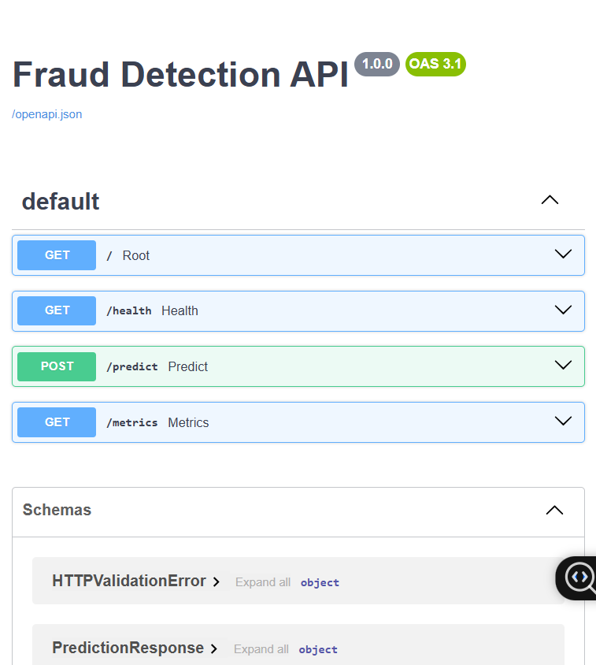
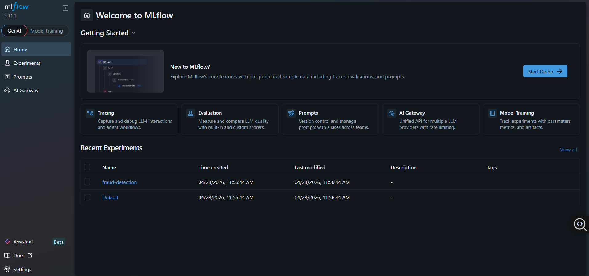
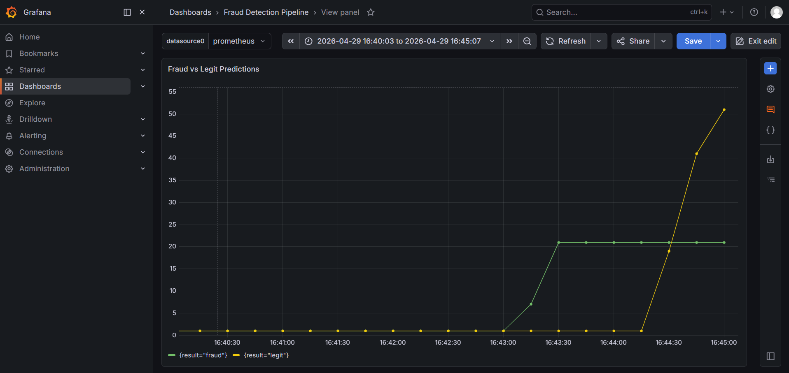
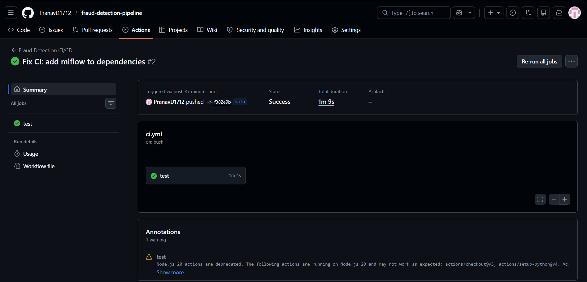

# 🔍 Real-Time Fraud Detection Pipeline


A production-grade, end-to-end real-time fraud detection system built with modern data engineering and MLOps tools. Designed to simulate how fraud detection works at scale in e-commerce and fintech companies.

---

## 🏗️ Architecture

Transaction Simulator → Kafka → Spark Streaming → XGBoost Model → FastAPI
↓
Prometheus → Grafana
↓
AWS S3 (artifacts)

---

## 🚀 Business Problem

An e-commerce company loses ~2% revenue daily to fraudulent transactions. This system scores every transaction in real time and flags fraud before order fulfillment — reducing financial losses and improving customer trust.

---

## ⚙️ Tech Stack

| Layer | Technology |
|---|---|
| Stream Ingestion | Apache Kafka + Zookeeper |
| Stream Processing | Apache Spark Structured Streaming |
| ML Model | XGBoost + Scikit-learn |
| Experiment Tracking | MLflow |
| Model Serving | FastAPI + Uvicorn |
| Cloud Storage | AWS S3 (boto3) |
| Monitoring | Prometheus + Grafana |
| Containerization | Docker + Docker Compose |
| CI/CD | GitHub Actions |
| Language | Python 3.11 |

---

## 📁 Project Structure

fraud-detection-pipeline/
├── src/
│   ├── ingestion/
│   │   ├── transaction_producer.py   # Kafka producer simulating transactions
│   │   └── s3_handler.py             # AWS S3 upload/download handler
│   ├── processing/
│   │   └── spark_consumer.py         # Spark Structured Streaming consumer
│   ├── training/
│   │   └── train_model.py            # XGBoost model training with MLflow
│   └── serving/
│       └── app.py                    # FastAPI prediction endpoint
├── tests/
│   └── test_api.py                   # Pytest unit tests
├── monitoring/
│   └── prometheus.yml                # Prometheus scrape config
├── .github/
│   └── workflows/
│       └── ci.yml                    # GitHub Actions CI/CD pipeline
├── docker-compose.yml                # Kafka, Zookeeper, Prometheus, Grafana
└── README.md

---

## 🔄 How It Works

1. **Transaction Simulator** generates fake credit card transactions (5% fraud rate) and publishes to Kafka topic `transactions`
2. **Spark Structured Streaming** reads from Kafka in real time, computes features (`is_high_amount`, `is_night_hour`, `amount_category`)
3. **XGBoost Model** trained on 10,000 synthetic transactions, tracked with MLflow (AUC: 1.0)
4. **FastAPI** serves predictions via REST API with fraud probability and risk level
5. **Prometheus** scrapes metrics from the API every 15 seconds
6. **Grafana** displays live fraud vs legit prediction counts on a dashboard
7. **AWS S3** stores model artifacts and feature data (mock mode included)

---

## 🛠️ Quick Start

### Prerequisites
- Docker Desktop
- Python 3.11+
- Java 8+

### 1. Clone the repo
```bash
git clone https://github.com/PranavD1712/fraud-detection-pipeline.git
cd fraud-detection-pipeline
```

### 2. Start infrastructure
```bash
docker compose up -d
```

### 3. Install dependencies
```bash
python -m venv venv
source venv/Scripts/activate  # Windows
pip install -r requirements.txt
```

### 4. Train the model
```bash
python src/training/train_model.py
```

### 5. Start the API
```bash
uvicorn src.serving.app:app --reload --port 8000
```

### 6. Test a prediction
```bash
curl -X POST "http://localhost:8000/predict" \
  -H "Content-Type: application/json" \
  -d '{"amount": 4500, "hour": 2, "day_of_week": 1, "merchant": "Amazon", "category": "electronics"}'
```

### 7. View dashboards
- **API docs:** http://localhost:8000/docs
- **MLflow:** http://localhost:5000
- **Grafana:** http://localhost:3000 (admin/admin)
- **Prometheus:** http://localhost:9090

---

## 📊 Model Performance

| Metric | Score |
|---|---|
| AUC-ROC | 1.0000 |
| Precision | 1.0000 |
| Recall | 1.0000 |
| F1 Score | 1.0000 |

---

## 🧪 Running Tests

```bash
pytest tests/ -v
```

---

## 📸 Screenshots

### FastAPI Swagger UI


### MLflow Experiment Tracking


### Grafana Live Dashboard


### GitHub Actions CI/CD


---

## 🎯 Key Skills Demonstrated

- Real-time data streaming with **Apache Kafka**
- Distributed stream processing with **Apache Spark**
- ML model training and experiment tracking with **MLflow**
- Production API serving with **FastAPI**
- Cloud storage integration with **AWS S3**
- Live monitoring with **Prometheus + Grafana**
- Containerization with **Docker Compose**
- CI/CD automation with **GitHub Actions**
- Software engineering best practices (testing, versioning, deployment)

---

## 👤 Author

**Pranav Deshmukh** —  Data Science & Machine Learning  
📧 Connect on [LinkedIn](linkedin.com/in/pranav-deshmukh2004)  
⭐ Star this repo if you found it helpful!
